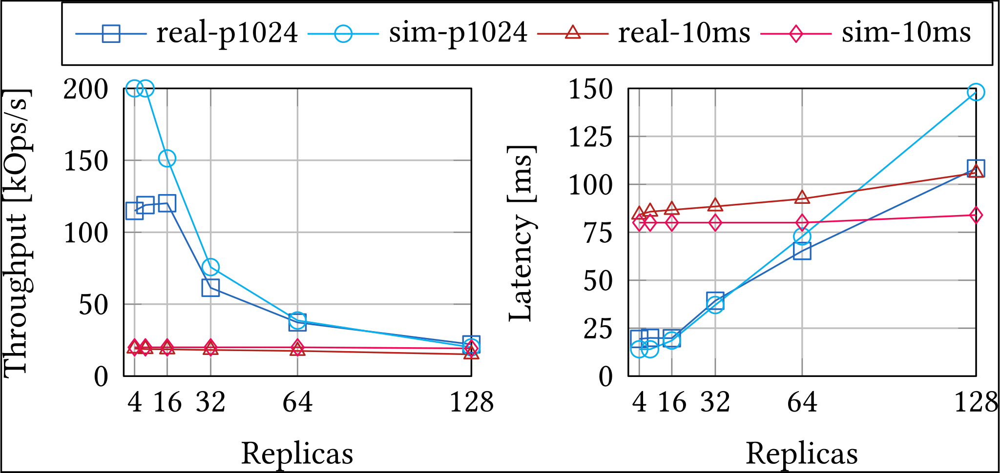

# Delphi-BFT

Delphi-BFT is a toolchain for simplifying and automating large-scale simulations of real BFT protocol implementations on top of the existing [Phantom (alias Shadow v2)](https://github.com/shadow/shadow) simulator. We currently tested simulations for the protocol implementations of PBFT, BFT-SMaRt and Hot-Stuff. Using Phantom simulations, we can predict system metrics like throughput and latency of real, unmodified BFT protocol implementations.

This simulation method is resource-friendly and preserves application-realism since existing BFT frameworks can be simply plugged into the simulation engine without requiring code modifications or re-implementation. Further, the approach is useful to understand the performance of BFT protocols if they are network-bound.

### Showcase: Reproducing results from HotStuff evaluations

We try to mimic the evaluation setup of the HotStuff paper (https://arxiv.org/abs/1803.05069) to compare their measurements with our simulation results. Their setup consists of more than hundred virtual machines deployed in an AWS data center; each machine has up to 1.2 GB/s bandwidth and there is less than 1 ms latency between each pair of machines (we use 1 ms in the simulation). The employed batch size is 400. We compare against two measurement series: "p1024" where the payload size of request and responses is 1024 bytes and  
"10ms" with empty payload but the latency of all communication links is set to 10 ms.



We display our results in the Figure above. The simulation results for the payload experiment indicate a similar trend as the real measurements, where performance starts to drop for n >= 32. For a small sized replica group, the network simulation predicts higher performance: 200k tx/s. This equals the theoretical maximum limited only through the 1 ms link latency which leads to pipelined HotStuff committing a batch of 400 requests every 2 ms.
The difference in throughput decreases once the performance of HotStuff becomes more bandwith-throttled (at n >= 32). We also achieve close results in the "10ms" setting: 80 ms in the simulation vs 84.1 ms real, and 20k tx/s in the simulation vs. 19.2k tx/s real for$n=4; but with an increasing difference for higher n, i.e., 84 ms vs. 106 ms and 19k.2 tx/s vs. 15.1k tx/s for n=128.

### Features and Design Goals of Delphi-BFT

- Usability
- Configurability
- Bulk Experimentation
- WAN Topology Generation
- Automated Protocol Bootstrapping
- Resource Monitoring
- Plotting
- Modularity / Extensibility

### Architecture of Delphi-BFT

##### Orchestrator

The toolchain is administered by an orchestrator, that manages all tools,
i.e., for preparing an environment, configuring runtime artifacts for a BFT protocol, and initializing a resource monitor. The orchestrator invokes protocol connectors to setup a BFT protocol and loads `experiments description files` which contain a set of experiments to be conducted for the specified BFT protocol. Finally, it starts Phantom, once an experiment is ready for its execution.

##### Environment Generator

The environment generator creates network topologies as complete graph for any system size. The network topologies resemble realistic deployment scenarios for a LAN or WAN setting. To create network graphs with network links reflecting a realistic geographic dispersion of nodes, the environment generator employs a cloudping component which retrieves real round-trip latencies between all AWS regions from Cloudping (https://www.cloudping.co/grid). This allows the tool to create network topologies which resemble real BFT protocol deployments on the AWS cloud infrastructure.

##### Protocol Connectors

For each BFT protocol implementation that we want to simulate, it is necessary to create protocol configuration files and necessary keys. Since protocol options and cryptographic primitives vary depending on the concrete BFT protocol, we implement the protocol-specific setup routine as a tool called protocol connector, which is invoked by the orchestrator.
A connector must implement the methods `build()` and `configure()`
This way, it is simple to extend our toolchain and support new BFT protocols, as it only requires writing a new protocol connector (in our experience this means writing between 100 and 200 LoC).

##### Resource Monitor

The orchestrator initializes a resource monitor to collect information on resource consumption (like allocated memory and CPU time) during simulation runs and also the total simulation time.

##### Plotter

Results are stored to the file system by Phantom. They can be aggregated and mapped to specific diagrams for specifiable metrics like latency of throughput. For instance, it can create diagrams that display the performance of a BFT protocol for increasing system scale which aggregate several simulation runs for an increasing n (or any other variable).

### Compatibility (tested but no gurantees are given)

We recommend Ubuntu 20.04 LTS and Shadow v2.2 (newest version as of time of writing).

### Dependencies

**Node version (16.3.0):**

```
curl -sL https://raw.githubusercontent.com/nvm-sh/nvm/v0.35.0/install.sh -o install_nvm.sh

bash install_nvm.sh

export NVM_DIR="$HOME/.nvm"
  [ -s "$NVM_DIR/nvm.sh" ] && \. "$NVM_DIR/nvm.sh"  # This loads nvm
  [ -s "$NVM_DIR/bash_completion" ] && \. "$NVM_DIR/bash_completion"

nvm install 16.3.0

```

**Shadow:**

Ubuntu:

```
 apt-get install -y \
    cmake \
    findutils \
    libc-dbg \
    libglib2.0-0 \
    libglib2.0-dev \
    make \
    python3 \
    python3-pip \
    xz-utils \
    util-linux \
    gcc \
    g++

curl --proto '=https' --tlsv1.2 -sSf https://sh.rustup.rs | sh

apt-get install -y \
    python3-numpy \
    python3-lxml \
    python3-matplotlib \
    python3-networkx \
    python3-scipy \
    python3-yaml

apt-get install -y \
    dstat \
    git \
    htop \
    tmux

```

**HotStuff:**

Ubuntu:

```
apt-get install libssl-dev libuv1-dev cmake make libtool autoreconf

```

Ubuntu: ( at least 20.04 ?) additionally:

```
sudo apt-get install libtool autoconf

```

### Building, and Getting started :-)

First, install Shadow v2.2, for details on this, we refer to https://github.com/shadow/shadow

```
$ ./setup build --clean --test
$ ./setup test
$ ./setup install
```

After installing Shadow, it is imporant for the orchestrator to add it to your PATH:

```
echo 'export PATH="${PATH}:/home/${USER}/.local/bin"' >> ~/.bashrc && source ~/.bashrc
```

Now it is time, to clone this repository and install the tool:

```
cd shadow-experiments && git submodule update --init --recursive && npm install

```

We should test now if building, works, try out In tool/libhotstuff:

```
cmake -DCMAKE_BUILD_TYPE=Release -DBUILD_SHARED=ON -DHOTSTUFF_PROTO_LOG=ON
make
```

To start an experiment you have to pass an experiment description file to the orchestrator. See `examples/[ProtocolName].yaml`.

IMPORTANT: rename .env.example to .env and change the placeholders with the appropriate directories.

Once this is completed you can start the simulation, passing the experiment description file like this :

```
npm run simulation -- examples/hotstuff/hs3-aws.yaml
```

HINT: Use `tmux` to run your simulations in the background

### If you want to make a connector for another protocol

Your connector has to implement the methods `build`, `configure`, `getProcessName`, `getExecutionDir` and `getExperimentsOutputDirectory`

Experiment description files have to adhere to a certain format:

```
protocolName: name of your protocol
protocolConnectorPath: path to your protocol connector
experiments: Array describing the experiments to be made
    exp1: description of an experiment
        misc: miscelleanous settings
            duration: duration of the experiment
            useShortestPath: whether to Dijkstra
            parallelism: you know :)
        network:
            bandwidthUp: ..
            bandwidthDown: ..
            latency:
                uniform: (true|false)
                if true:
                  replicas: inter-replica latency ex: 1000 us
                  clients: client-replica latency ex 1000 us
                else:
                  replicas: Array describing AWS hosts format region: host
                  clients: Array describingAWS hosts format region: host OR a uniform client-replica latency
        replica:
            This is for protocol-specific and replica-specific configurations, this will be passed to
            your connector.
        client:
            This is for protocol-specific and replica-specific configurations, this will be passed to
            your connector.
```
you may also use the .env file to define protocol-specific settings
